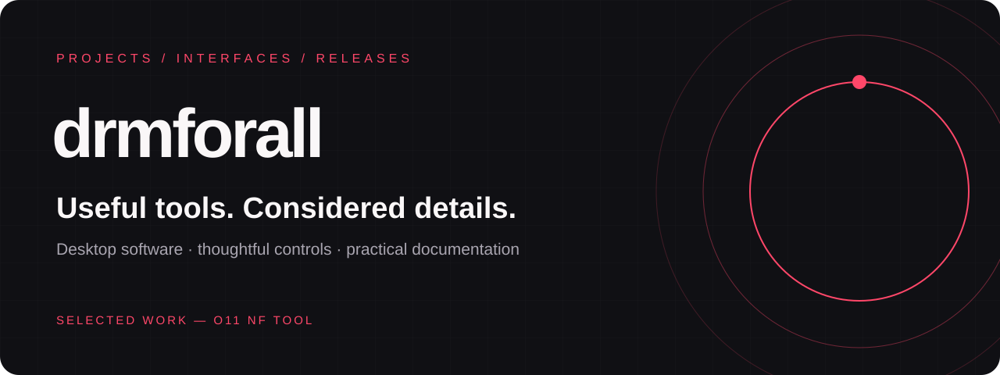

  <a href="https://drmforall-portfolio.priyankzindahai.chatgpt.site">Explore the portfolio ↗</a> &nbsp; · &nbsp;
  <a href="https://github.com/drmforall/o11-nf-tool">Featured project</a> &nbsp; · &nbsp;
  <a href="https://github.com/drmforall/o11-nf-tool/releases/tag/v1.0.1">Latest release</a>

## Selected work

### o11 NF Tool

A Windows desktop workspace with dedicated movie and show controls, quality selection, audio and subtitle options, and a visible activity log. The repository presents the finished application, screenshots, release downloads, and usage documentation.

|  Media workspace |  Audio & subtitles |  Windows releases |
| :--- | :--- | :--- |
| Movie and show modes with season and episode inputs. Quality controls include a 1080p ceiling. | Original-language mode, audio choices, and subtitle controls are documented in the project guide. | Standalone executable, portable ZIP, and installer are available in release v1.0.1. |

**[Read the project guide ↗](https://github.com/drmforall/o11-nf-tool#readme)** · **[Get the release ↗](https://github.com/drmforall/o11-nf-tool/releases/tag/v1.0.1)** · **[Check Windows compatibility ↗](https://github.com/drmforall/o11-nf-tool/blob/main/WINDOWS-BUILDS.md)**

## Details that matter

|  Interface |  Delivery |  Documentation |
| :--- | :--- | :--- |
| Clear controls, distinct modes, and visible application activity. | Multiple package formats for different installation preferences. | Real screenshots, feature descriptions, setup instructions, and compatibility notes. |

Visit the **[public portfolio](https://drmforall-portfolio.priyankzindahai.chatgpt.site)** for a closer look at the interface and downloadable packages.

Built around real projects. Designed with care.

